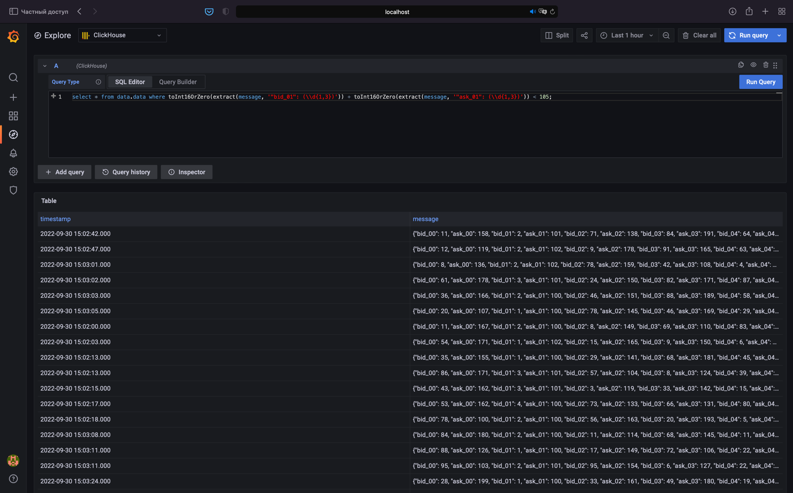

Первая попытка

## Описание

### Как запустить:

Собрать образ app, пересоздать контэйнеры если есть и curl ом добавить датасоурс, чтоб не руками через ui
```shell
docker-compose up -d --force-recreate --build && make set_datasource
```

После отработки команды можно зайти по [ссылке](http://localhost:3000/explore?orgId=1&left=%5B%22now-1h%22,%22now%22,%22ClickHouse%22,%7B%22refId%22:%22A%22,%22queryType%22:%22sql%22,%22rawSql%22:%22select%20*%20from%20data.data%20where%20toInt16OrZero(extract(message,%20%27%5C%22bid_01%5C%22:%20(%5C%5C%5C%5Cd%7B1,3%7D)%27%29%29%20%2B%20toInt16OrZero(extract(message,%20%27%5C%22ask_01%5C%22:%20(%5C%5C%5C%5Cd%7B1,3%7D)%27%29%29%20%3C%20105;%22,%22meta%22:%7B%22builderOptions%22:%7B%22mode%22:%22list%22,%22fields%22:%5B%5D,%22limit%22:100%7D%7D,%22format%22:1%7D%5D)

Авторизация стандартная: 
Username: admin
Password: admin
Смена пароля - skip

При успешном исходе должно быть вот так


Если вдруг ссылка не сработает, то ch доступен по localhost без пароля

Запрос: 
```sql
select * from data.data where toInt16OrZero(extract(message, '"bid_01": (\\d{1,3})')) + toInt16OrZero(extract(message, '"ask_01": (\\d{1,3})')) < 105;
```

Так же можно запрос выполнить в grafana на вкладке explore

### app

/app - каталог с самим приложением

Для логов в json добавил json_log_formatter, описав зависимость в requirements.txt

Добавил запись сгенерированных данных в ch. Если данные нужны на столько, что по ним строятся какие-то метрики, то лучше их самостоятельно писать в базу, чем вытягивать из логов, в которые пишет приложение
Плюсы: 
- Меньше бесполезного спама в логах
- Проще организовать запись + не нужно дополнительно ставить/конфигурить экспортеры логов, писать на них парсинг + писать, судя по v1, кастомные варианты записи в ch
Минусы:
- не нашел ¯\_(ツ)_/¯

Написал Dockerfile для установки нужных пакетов и запуска приложения

Запуск:

### ch

Запускается из контэйнера с дефолтным конфигом
Нужно только создать схему для записи данных из приложения, что делается через маунт init.sql в контэйнер

### grafana

Если нужен именно мониторинг + алерты по данным, то нужна для его построения, но тк в задании об этом мало сказано, просто поднял чтоб показать что через нее можно получить данные + развивать во что-то большее

Про создание datasource в графане кодом мало что нашел подходящего, так что закинул в Makefile создание curlом

Попробовал grafonnet + jsonnet. Через них можно накодить создание борды с алертами в графане. Работает, но чтоб не тратить время развивать особо ничего инетресного не придумал - удалил

## Мысли/заметки

Изначально было много мыслей на тему того, что собирать что-то внятное через сбор логов в кх не очень верный путь
Если это метрики, то они должны как метрики идти в какое-то хранилище метрик и дальше, но не из логов точно
Если это какие-то важные данные, а раз по ним нужнен мониторинг то они важные, значит их, возможно, лучше и в базу сразу писать -> из нее потом строить метирки, а не из логов опять же
Флоу построения алертов по логам тоже рабочий, но кажется не совсем верным
Я бы назвал это исключением скорее, чем основоным путем развития, но такой вариант тоже есть. Зависит от специфики, которой в задаче не описано

Что изменилось с v1:
- Добавил запись из приложения в ch
- Убрал сборщик логов, тк данные и так попадают в ch
- Сбор логов уже можно организовать через elk стек и вот это все, если они еще нужны
- Добавил grafana для просмотра и дальнейшего развития задачи, хотя запрос можно выполнить прямо в ch
- Запихнул в docker-compose

Отдельно про docker-compose и его сети:
В силу того, что разворачивать много чего на одной виртуалки +- антипаттерн, то я такое далеко не каждый день использую
Варианты, которые в гугле работают, на практике работать не хотят
Возможно проблема была в том, что в прошлой версии кх не успевал подниматься и реально рабочий вариант я посчитал нерабочим не обратив на это внимание
В этой версии app поднимается только после того как ch пройдет healthcheck

Так как для коннекта app>ch и grafana>ch используется дефолтная bridge сеть докера, на которой могут быть заняты указанные в коде ip, может потребоваться их поменять, но на чистой сети должно работать

